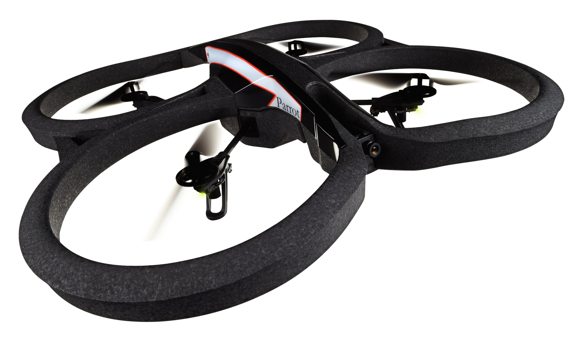

# Drone Wifi Triangulation
Asad Alavi, Debanjum Solanky, Pat Xu, Vishal Gaurav

We detect a specific wifi signal with a Raspberry Pi mounted on a Parrot ARDrone. This README has most of the important details, but we discuss the process in detail in three papers. [Paper 1](https://docs.google.com/document/d/1XIbju8fm_IRwirzsdrcrM29-ahBGkG1RVNki1plZxBo/edit?usp=sharing), [Paper 2](https://docs.google.com/document/d/1kJNB-iXc_bjHV0GzgPN8mEg7z6CxGRbBdsk2Z4-aWfo/edit?usp=sharing), [Paper 3](https://docs.google.com/document/d/13-lwsP2QbEAiy2kiwCjI_P3fWlUSXTzz47MASvEG2Uk/edit?usp=sharing).



## Architecture
- ARDrone
  - [SDK](http://developer.parrot.com/products.html)
  - [Documentation](http://www.msh-tools.com/ardrone/ARDrone_Developer_Guide.pdf)


The **Drone Controller** files can be found in `drone-controller`.

- ### Python
  - ARDrone SDK ([github](https://github.com/faturita/python-ardrone))
  - our `stabledrone.py` script calls built-in capabilities of the ARDrone to detect and hover over their supplied marker.

  

- ### Node.js
  - [Node.js Drone Package](https://github.com/felixge/node-ar-drone)  
  - The Node.js controller is found at `node-js`.
    - `npm install`

  - to get drone PNG feed install `ar-drone-png-stream` (https://github.com/Soarez/ar-drone-png-stream) module using
    - `npm install ar-drone-png-stream`

- ### ROS ARDrone Autonomy
  - primarily followed [this guide](http://wiki.ros.org/tum_ardrone)
  - installed ROS on MacOS via [Docker](http://wiki.ros.org/docker/Tutorials/Docker)
  - also had to follow the [pre-install instructions](https://github.com/tum-vision/ardrone_autonomy#pre-requirements) on the ARDrone Autonomy Github
  - [Docker Hub repo](https://hub.docker.com/r/patxu/ardrone/)
    - check current docker images with `docker images`
      ```
      REPOSITORY          TAG                 IMAGE ID            CREATED             SIZE
      patxu/ardrone       latest              550afefe761a        9 hours ago         1.3 GB
      ```
    - run the image with `docker exec -it patxu/ardrone`
    - custom setup script that runs some basic commands at `ardrone_setup.sh`

  - connect to two Wifi networks by using a [Wifi card](https://www.amazon.com/Edimax-EW-7811Un-150Mbps-Raspberry-Supports/dp/B003MTTJOY/ref=sr_1_fkmr0_1?ie=UTF8&qid=1485920981&sr=8-1-fkmr0&keywords=edimax+eq+7811). this will allow you to connect to the drone while maintaining internet service


## The Team
- Asad Alavi, GR
- Debanjum Solanky, GR
- Pat Xu, '17
- Vishal Gaurav, GR
